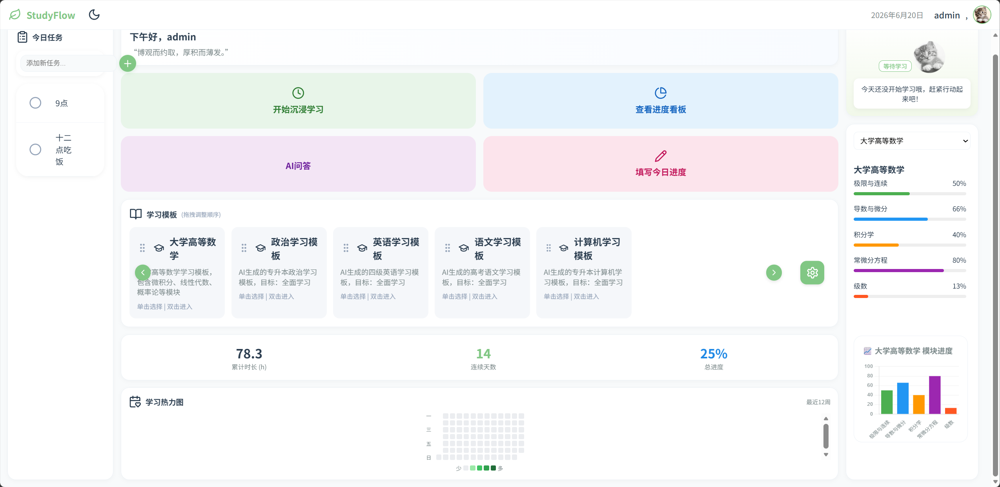
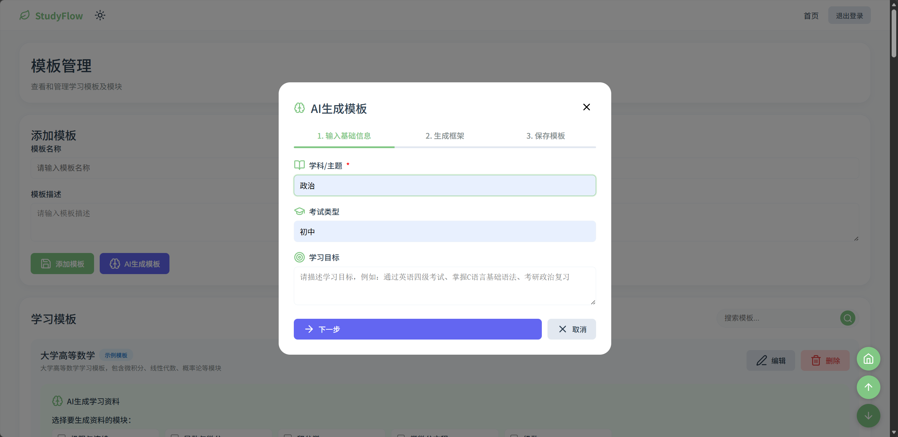
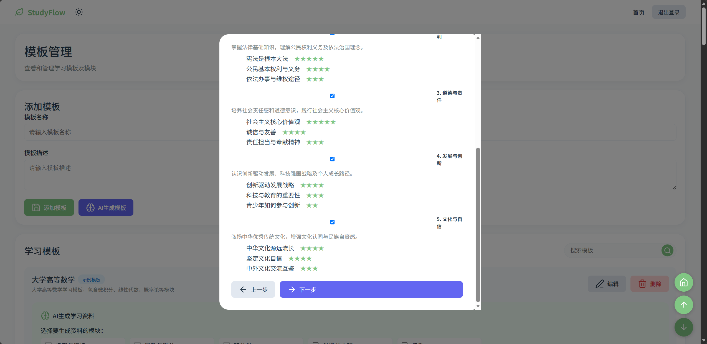
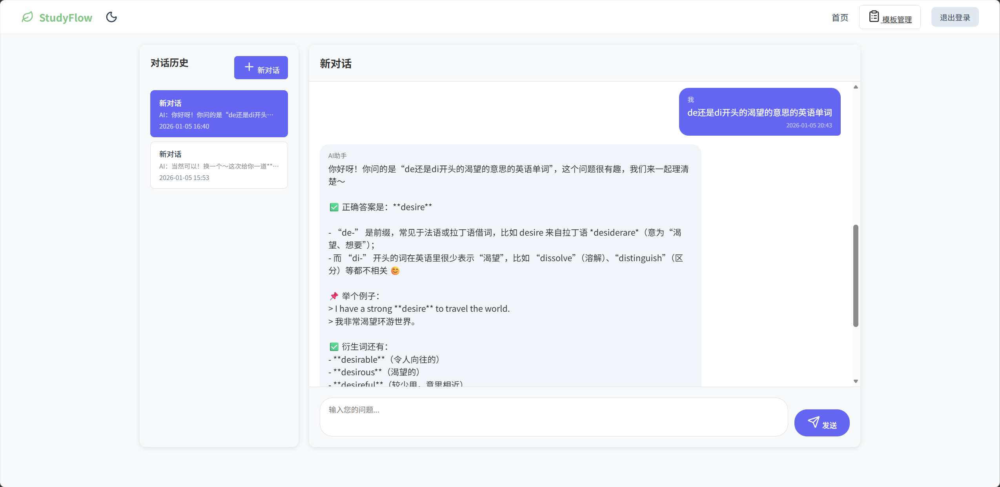
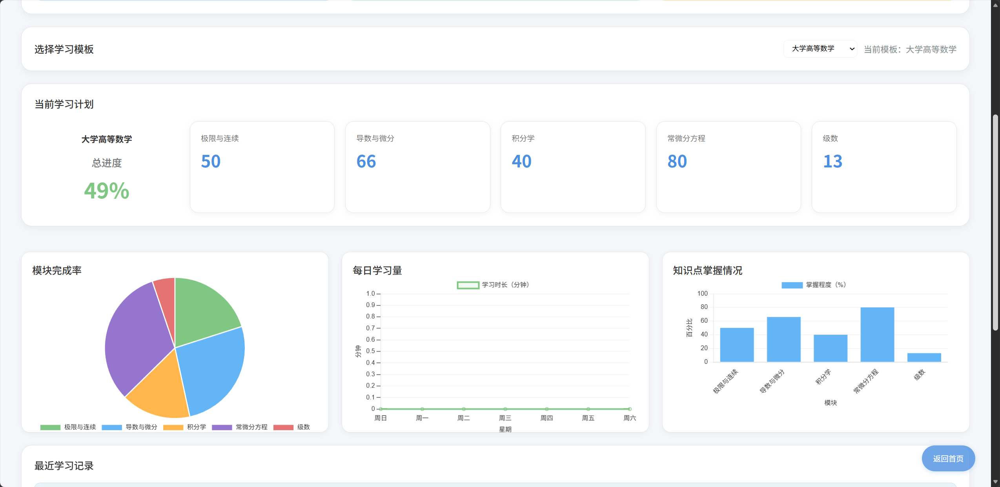
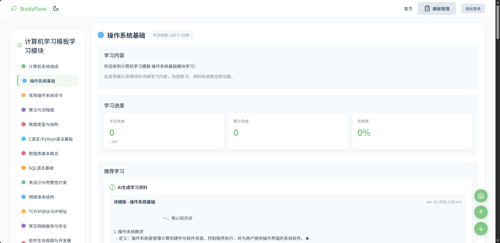
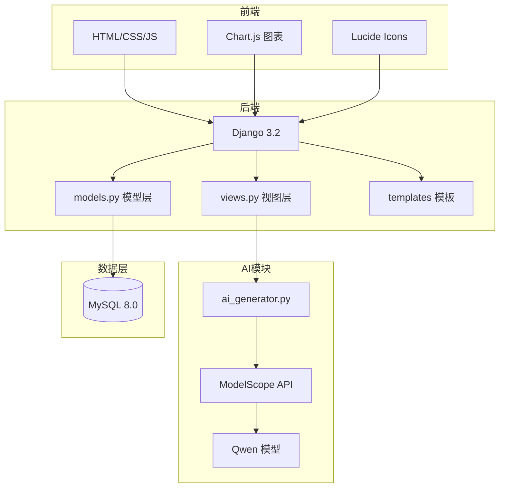

# 智能学习管理系统

> 基于 Django + ModelScope AI 的智能学习管理平台，让 AI 帮你制定学习计划、生成学习资料。

<p align="center">
  
  
  
  
  
</p>

---

## 项目截图

### 学习看板（首页）

<p align="center">
  
</p>

### AI 智能生成学习模板

<p align="center">
  
</p>

### AI 生成学习内容

<p align="center">
  
</p>

### AI 学习助手

<p align="center">
  
</p>

### 进度看板

<p align="center">
  
</p>

### 学习热力图

<p align="center">
  
</p>


---

## 核心功能

<table>
<tr>
  <td width="50%">
    <h3>AI 智能生成学习计划</h3>
    <p>输入学科和考试类型，AI 自动生成知识框架、章节划分和学习资料。支持四级、考研、专升本等各类考试。</p>
  </td>
  <td width="50%">
    <h3>可视化学习看板</h3>
    <p>Chart.js 驱动的进度仪表盘，直观展示每日学习时长、模块完成率、连续打卡天数。</p>
  </td>
</tr>
<tr>
  <td width="50%">
    <h3>专注计时器</h3>
    <p>内置番茄钟式计时器，记录每次学习时长，自动统计累计学习时间。</p>
  </td>
  <td width="50%">
    <h3>AI 学习助手</h3>
    <p>基于 ModelScope Qwen 模型的实时对话助手，随时解答学习中的疑问。</p>
  </td>
</tr>
<tr>
  <td width="50%">
    <h3>任务管理</h3>
    <p>待办事项清单，支持优先级设定，与学习计划联动。</p>
  </td>
  <td width="50%">
    <h3>数据导出</h3>
    <p>支持导出学习记录，方便分析和复盘。</p>
  </td>
</tr>
</table>

---

## 系统架构



---

## 快速开始

### 环境要求

- Python 3.7+
- MySQL 5.7+ / 8.0
- ModelScope API Key（[免费获取](https://modelscope.cn)）

### 安装步骤

```bash
# 1. 克隆项目
git clone https://github.com/你的用户名/仓库名.git
cd dbstudy

# 2. 创建虚拟环境
python -m venv .venv
.venv\Scripts\activate      # Windows
# source .venv/bin/activate # macOS/Linux

# 3. 安装依赖
pip install -r requirements.txt

# 4. 配置环境变量
cp .env.example .env
# 编辑 .env，填入你的数据库密码和 ModelScope API Key

# 5. 创建数据库
# 在 MySQL 中执行：
# CREATE DATABASE dbstudy_db CHARACTER SET utf8mb4 COLLATE utf8mb4_unicode_ci;

# 6. 数据库迁移
cd study
python manage.py migrate

# 7. 启动
python manage.py runserver
```

浏览器访问 **http://127.0.0.1:8000**

---

## 项目结构

```
dbstudy/
├── study/                       # Django 项目
│   ├── study/                   # 项目配置
│   │   ├── settings.py          # Django 设置
│   │   ├── urls.py              # URL 路由
│   │   └── wsgi.py              # WSGI 入口
│   ├── study_dashboard/         # 主应用
│   │   ├── models.py            # 数据模型（11张表）
│   │   ├── views.py             # 视图逻辑
│   │   ├── ai_generator.py      # AI 生成模块
│   │   ├── admin.py             # 后台管理
│   │   └── migrations/          # 数据库迁移文件
│   └── manage.py                # Django 管理命令
├── templates/                    # HTML 模板
├── static/                       # 静态资源（CSS/JS/图片）
├── docs/                         # 技术文档
├── requirements.txt              # Python 依赖
├── .env.example                  # 环境变量模板
└── .gitignore                    # Git 忽略规则
```

---

## 技术文档

| 文档 | 说明 |
|------|------|
| [系统架构](docs/SYSTEM_ARCHITECTURE.md) | 技术栈、架构设计、部署方案 |
| [数据库设计](docs/DATABASE_DESIGN.md) | E-R 图、表关系、数据流程 |
| [数据库表结构](docs/DATABASE_STRUCTURE.md) | 11张表的详细字段说明 |
| [API 规范](docs/API_SPECIFICATION.md) | 接口定义、请求/响应格式 |
| [AI 服务集成](docs/AI_SERVICE_INTEGRATION.md) | ModelScope API 配置与调用 |
| [部署指南](docs/DEPLOYMENT_GUIDE.md) | 从零部署到运行的完整步骤 |
| [功能流程图](docs/FUNCTION_FLOWCHARTS.md) | 各模块业务流程图 |
| [安全设计](docs/SECURITY_DESIGN.md) | 安全措施与防护策略 |
| [第三方库说明](docs/THIRD_PARTY_LIBRARIES.md) | 依赖库版本与用途 |
| [代码清单](docs/CODE_LISTING.md) | 核心模块代码说明 |
| [测试文档](docs/TESTING_MATERIALS.md) | 测试用例与覆盖率 |

---

## 技术栈

| 层级 | 技术 |
|------|------|
| 后端框架 | Django 3.2 |
| 数据库 | MySQL 8.0 |
| AI 模型 | ModelScope Qwen/Qwen3-VL-8B-Instruct |
| 前端 | HTML5 / CSS3 / JavaScript |
| 图表 | Chart.js |
| 图标 | Lucide Icons |
| CSS 框架 | Tailwind CSS |
| 图片处理 | Pillow |

---

## License

MIT License