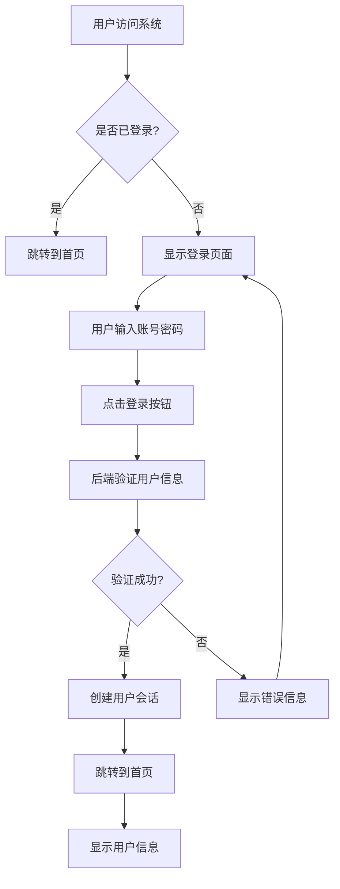
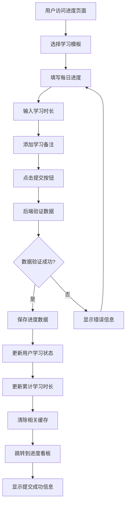
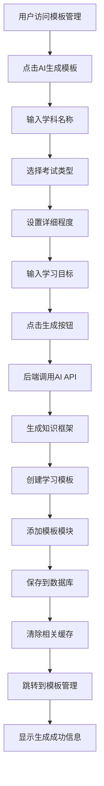
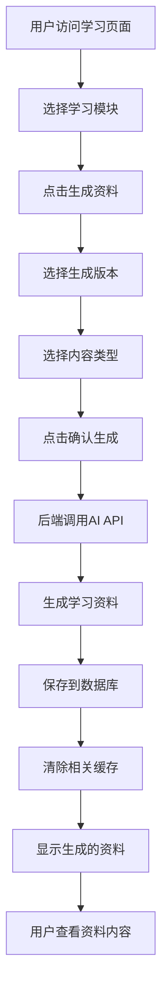
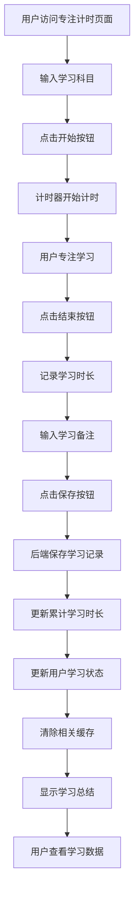
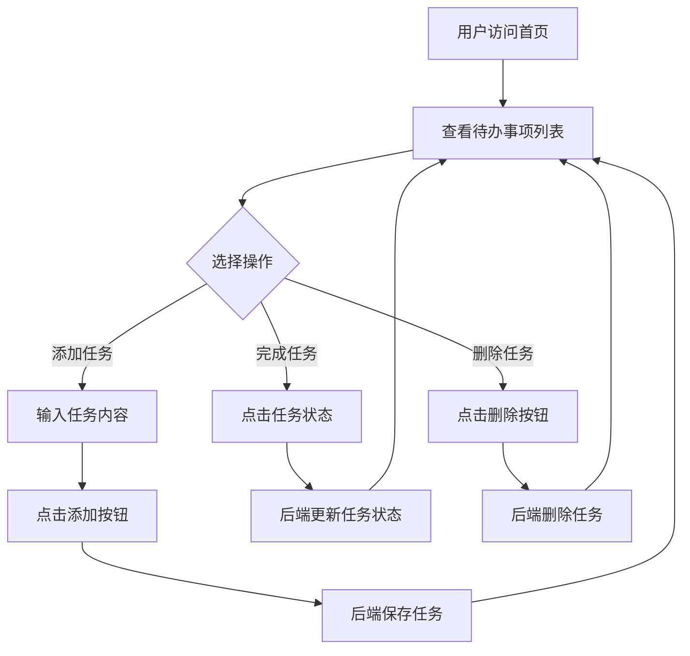
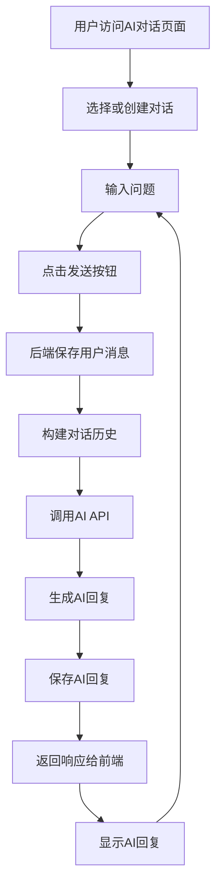
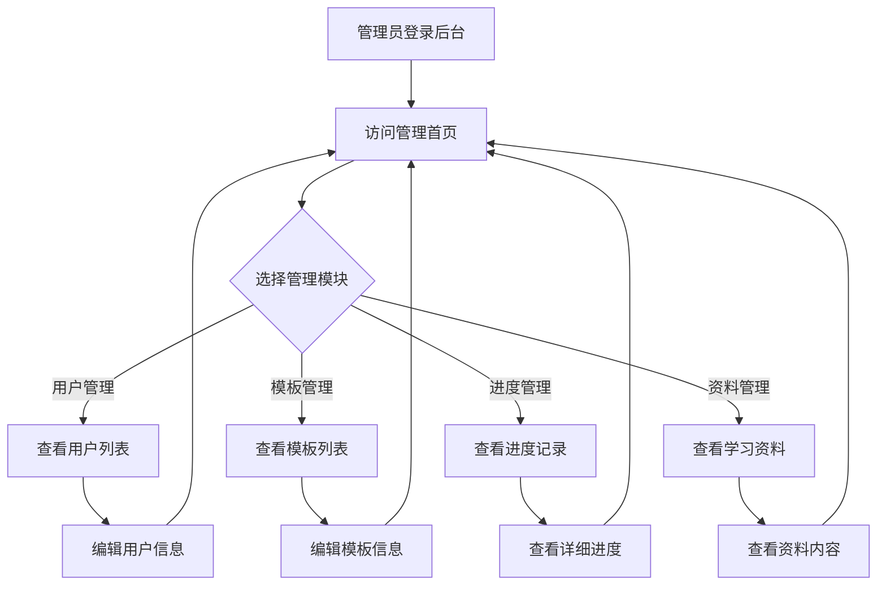

# 智能学习管理系统 - 功能流程图

## 1. 用户登录流程图

```mermaid
flowchart TD
    A[用户访问系统] --> B{是否已登录?}
    B -->|是| C[跳转到首页]
    B -->|否| D[显示登录页面]
    D --> E[用户输入账号密码]
    E --> F[点击登录按钮]
    F --> G[后端验证用户信息]
    G --> H{验证成功?}
    H -->|是| I[创建用户会话]
    H -->|否| J[显示错误信息]
    J --> D
    I --> K[跳转到首页]
    K --> L[显示用户信息]
```

## 2. 作业提交流程图

```mermaid
flowchart TD
    A[用户访问进度页面] --> B[选择学习模板]
    B --> C[填写每日进度]
    C --> D[输入学习时长]
    D --> E[添加学习备注]
    E --> F[点击提交按钮]
    F --> G[后端验证数据]
    G --> H{数据验证成功?}
    H -->|是| I[保存进度数据]
    H -->|否| J[显示错误信息]
    J --> C
    I --> K[更新用户学习状态]
    K --> L[更新累计学习时长]
    L --> M[清除相关缓存]
    M --> N[跳转到进度看板]
    N --> O[显示提交成功信息]
```

## 3. 学习模板生成流程图

```mermaid
flowchart TD
    A[用户访问模板管理] --> B[点击AI生成模板]
    B --> C[输入学科名称]
    C --> D[选择考试类型]
    D --> E[设置详细程度]
    E --> F[输入学习目标]
    F --> G[点击生成按钮]
    G --> H[后端调用AI API]
    H --> I[生成知识框架]
    I --> J[创建学习模板]
    J --> K[添加模板模块]
    K --> L[保存到数据库]
    L --> M[清除相关缓存]
    M --> N[跳转到模板管理]
    N --> O[显示生成成功信息]
```

## 4. 学习资料生成流程图

```mermaid
flowchart TD
    A[用户访问学习页面] --> B[选择学习模块]
    B --> C[点击生成资料]
    C --> D[选择生成版本]
    D --> E[选择内容类型]
    E --> F[点击确认生成]
    F --> G[后端调用AI API]
    G --> H[生成学习资料]
    H --> I[保存到数据库]
    I --> J[清除相关缓存]
    J --> K[显示生成的资料]
    K --> L[用户查看资料内容]
```

## 5. 专注计时流程图

```mermaid
flowchart TD
    A[用户访问专注计时页面] --> B[输入学习科目]
    B --> C[点击开始按钮]
    C --> D[计时器开始计时]
    D --> E[用户专注学习]
    E --> F[点击结束按钮]
    F --> G[记录学习时长]
    G --> H[输入学习备注]
    H --> I[点击保存按钮]
    I --> J[后端保存学习记录]
    J --> K[更新累计学习时长]
    K --> L[更新用户学习状态]
    L --> M[清除相关缓存]
    M --> N[显示学习总结]
    N --> O[用户查看学习数据]
```

## 6. 待办事项管理流程图

```mermaid
flowchart TD
    A[用户访问首页] --> B[查看待办事项列表]
    B --> C{选择操作}
    C -->|添加任务| D[输入任务内容]
    C -->|完成任务| E[点击任务状态]
    C -->|删除任务| F[点击删除按钮]
    D --> G[点击添加按钮]
    G --> H[后端保存任务]
    E --> I[后端更新任务状态]
    F --> J[后端删除任务]
    H --> B
    I --> B
    J --> B
```

## 7. AI对话流程图

```mermaid
flowchart TD
    A[用户访问AI对话页面] --> B[选择或创建对话]
    B --> C[输入问题]
    C --> D[点击发送按钮]
    D --> E[后端保存用户消息]
    E --> F[构建对话历史]
    F --> G[调用AI API]
    G --> H[生成AI回复]
    H --> I[保存AI回复]
    I --> J[返回响应给前端]
    J --> K[显示AI回复]
    K --> C
```

## 8. 后台管理流程图

```mermaid
flowchart TD
    A[管理员登录后台] --> B[访问管理首页]
    B --> C{选择管理模块}
    C -->|用户管理| D[查看用户列表]
    C -->|模板管理| E[查看模板列表]
    C -->|进度管理| F[查看进度记录]
    C -->|资料管理| G[查看学习资料]
    D --> H[编辑用户信息]
    E --> I[编辑模板信息]
    F --> J[查看详细进度]
    G --> K[查看资料内容]
    H --> B
    I --> B
    J --> B
    K --> B
```